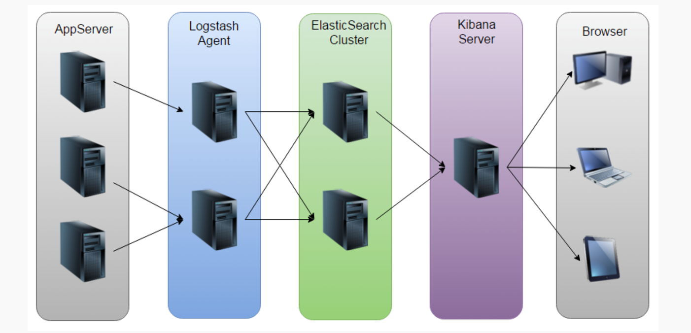
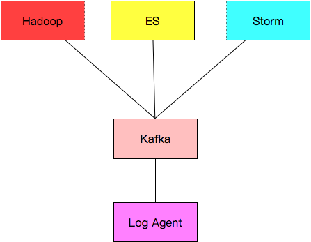
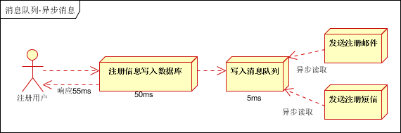
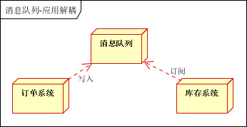

## 项目
1. 每个系统都有日志，当系统出现问题时，需要通过日志解决问题
1. 当系统机器比较少时，登陆到服务器上查看即可满足
1. 当系统机器规模巨大，登陆到机器上查看几乎不现实
## 解决方案
1. 把机器上的日志实时收集，统一的存储到中心系统
1. 然后再对这些日志建立索引，通过搜索即可以找到对应日志
1. 通过提供界面友好的web界面，通过web即可以完成日志搜索
## 面临的问题
1. 实时日志量非常大，每天几十亿条
1. 日志准实时收集，延迟控制在分钟级别
1. 能够水平可扩展
## 业界方案ELK

### ELK的不足之处
1. 运维成本高，每增加一个日志收集，都需要手动修改配置
2. 监控缺失，无法准确获取logstash的状态
3. 监控缺失，无法准确获取logstash的状态
### 本项目日志系统的架构

#### 介绍
1. Log Agent, 日志收集客户端，用来收集服务器上的日志
2. Kafka，高吞吐量的分布式队列，linkin开发，apache顶级开源项目
3. ES，elasticsearch，开源的搜索引擎，提供基于http restful的web接口
4. Hadoop，分布式计算框架，能够对大量数据进行分布式处理的平台
5. Strom 实时计算框架,通过pipe进行计算

### Kafka的优势
1. 异步处理, 把非关键流程异步化，提高系统的响应时间和健壮性

2. 应用解耦,通过消息队列

[推荐阅读:消息队列在分布式系统中的好处](http://www.cnblogs.com/linjiqin/p/5720865.html)
